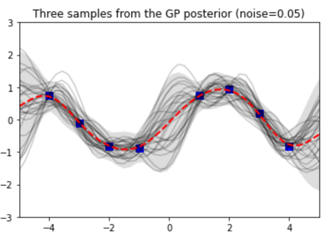

# Bayesian_opt_tutorial
This repository was made for the purpose of study, and includes Jupyter Notebooks on from-scratch tutorials of Bayesian optimization (BO) ([link](https://github.com/dongjae-shin/Bayesian_opt_tutorial/blob/main/230221_1D_GPR.ipynb)) and on Latin hypercube sampling (LHS) ([link](https://github.com/dongjae-shin/Bayesian_opt_tutorial/blob/main/230302_Latin_hypercube_sampling.ipynb)) for the initial sampling during the BO.

	

